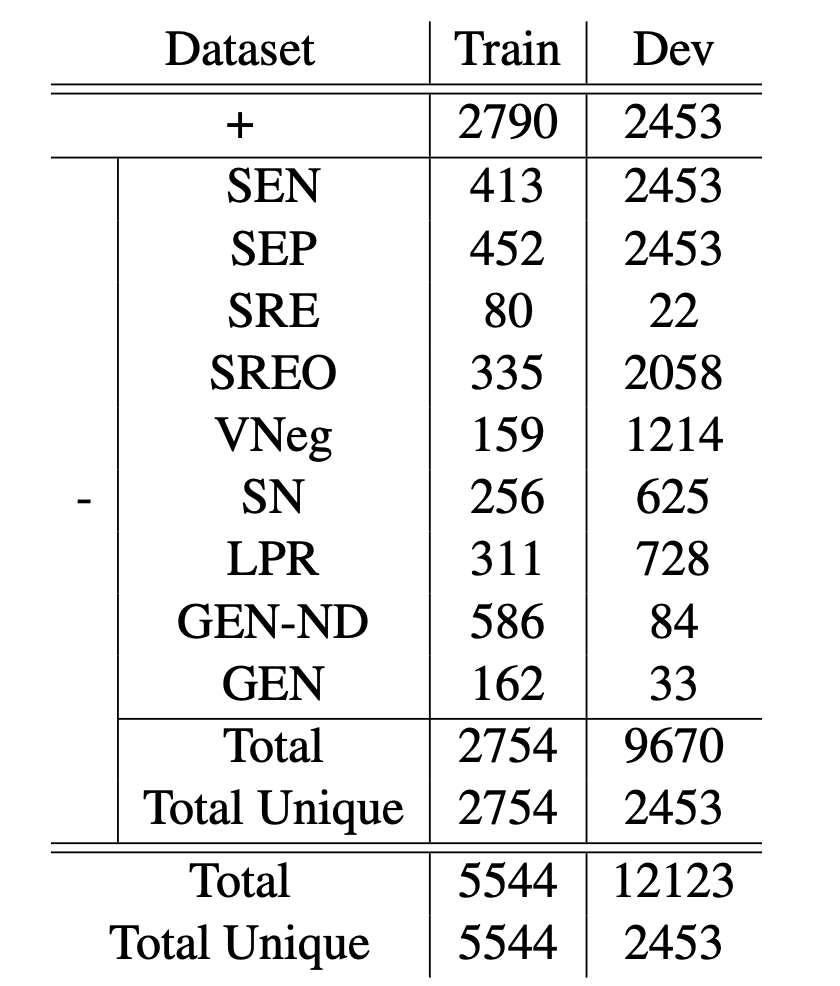

## What is BioNLI?
### BioNLI is a biomedical NLI dataset using controllable text generation


This is the official page for the paper:

<a href='https://arxiv.org/abs/2210.14814'> BioNLI: Generating a Biomedical NLI Dataset Using Lexico-semantic Constraints for Adversarial Examples </a>  
accepted at EMNLP2022 (Findings).
 <!-- You can find our paper <a href='https://arxiv.org/abs/2205.04652'> here </a> -->

<!-- Mohaddeseh Bastan, Nishant Shankar, Mihai Surdeanu, Niranjan Balasubramanian.  -->

BioNLI is the first dataset in biomedical natural language inference. This dataset contains abstracts from biomedical literature and mechanistic premises generated with nine different strategies. 

### Example
In the following example we see an example of an entry in the BioNLI dataset. Some supporting text was removed to save space. The premise is a set of sentences talking about two biomedical entiteis. The consistent hypothesis is the original conclusion sentence from the abstract paper, the inconsistent hypothesis is the generated sentence with one of the different nine strategies.

### Coming Soon ###


<!--  -->

### Dataset Statistics

There are two different versions of this dataset. One is the large distribution which contains all possible perturbations and the other is the balanced distirbution. They both share the same test set. For the full distribution, we generate as many perturbations as possible for dev and test set, but for training each instance is perturbed once.
#### Full Distribution:


#### Balanced Distribution:




### Download the data

The dataset can be downloaded here:

The full set can be downloaded from <a href="https://drive.google.com/drive/folders/1-wNvAYs4ULJFNkeVHaUJM3U7slX-vtiB?usp=sharing">here</a>.

The balanced set can be downloaded from <a href="https://drive.google.com/drive/folders/187W4RCk1cJnKKO95NPljxZYelUgMOHf8?usp=sharing">here</a>. 

To access the test set please contact <a href = "mailto: mbastan@cs.stonybrook.edu">me</a>.

### License

BioNLI is distributed under <a href="https://creativecommons.org/licenses/by/4.0/">CC BY 4.0 License</a>. 


### Liked us? Cite us!

Please use the following bibtex entry:
```
@inproceedings{bastan-etal-2022-sume,
    title = "{S}u{M}e: A Dataset Towards Summarizing Biomedical Mechanisms",
    author = "Bastan, Mohaddeseh  and
      Shankar, Nishant  and
      Surdeanu, Mihai  and
      Balasubramanian, Niranjan",
    booktitle = "Proceedings of the Thirteenth Language Resources and Evaluation Conference",
    month = jun,
    year = "2022",
    address = "Marseille, France",
    publisher = "European Language Resources Association",
    url = "https://aclanthology.org/2022.lrec-1.748",
    pages = "6922--6931",
    abstract = "Can language models read biomedical texts and explain the biomedical mechanisms discussed? In this work we introduce a biomedical mechanism summarization task. Biomedical studies often investigate the mechanisms behind how one entity (e.g., a protein or a chemical) affects another in a biological context. The abstracts of these publications often include a focused set of sentences that present relevant supporting statements regarding such relationships, associated experimental evidence, and a concluding sentence that summarizes the mechanism underlying the relationship. We leverage this structure and create a summarization task, where the input is a collection of sentences and the main entities in an abstract, and the output includes the relationship and a sentence that summarizes the mechanism. Using a small amount of manually labeled mechanism sentences, we train a mechanism sentence classifier to filter a large biomedical abstract collection and create a summarization dataset with 22k instances. We also introduce conclusion sentence generation as a pretraining task with 611k instances. We benchmark the performance of large bio-domain language models. We find that while the pretraining task help improves performance, the best model produces acceptable mechanism outputs in only 32{\%} of the instances, which shows the task presents significant challenges in biomedical language understanding and summarization.",
}
```

